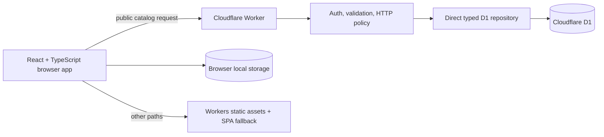

# Architecture

CatchGrid is a local-first Cloudflare Worker application: Vite builds the React single-page
app and Worker module, D1 provides the shared catalog, and each browser stores its own
trainer state under the versioned `dexly:local-profile:v1` local-storage key.



## Runtime boundaries

- `src/` owns presentation, interaction, transient UI state, and the typed API client.
- `shared/` owns transport/domain types plus deterministic collection, search, and CSV
  rules used by more than one runtime.
- `worker/index.ts` owns routing; `worker/auth.ts` and `worker/http.ts` own the security
  boundary; `worker/repository.ts` and `worker/imports.ts` own persistence workflows.
- `migrations/` is the source of truth for D1 schema and seed data.
- `catalog/catalog.v1.json` is the reviewed source manifest; generated migrations are
  what the running application reads from D1.
- `catalog/evolution-families.v1.json` is a compact, dated search aid generated from
  PoGoAPI evolution metadata. It is bundled at build time and never fetched at runtime.

The generated `Env` and binding declarations come from `wrangler types` and the
checked-in Wrangler configuration. The project does not depend on a separately
versioned `@cloudflare/workers-types` package.

## Why the repository uses direct typed D1

The persistence layer deliberately uses prepared D1 statements directly:

```ts
db.prepare('SELECT ... WHERE profile_id = ?').bind(profileId);
```

Each result shape has a narrow TypeScript row interface and is mapped at the repository
boundary into shared domain types. This keeps SQL, indexes, conflict rules, and D1 batch
behavior visible and auditable. The project intentionally has no ORM dependency.
Adopting one later should be an explicit architecture change with generated migrations
reviewed into `migrations/`; it must not create a competing schema source.

## Data model and consistency

The key separation is:

- catalog facts: species, forms, types, assets, collection categories, and per-form rules;
- trainer state: collection rows, trade-specific wanted rows, actual trade specimens,
  and profile revision;
- safety and audit state: mutation batches/items, import previews, and backup snapshots.

### Collection state

Collection state is sparse: a `collection_entries` row means collected, while no row
means the trainer has not marked that form/category. This is separate from eligibility.
A missing row does not mean a form is valid or released.

`form_category_rules.state` distinguishes `released`, `unreleased`, `ineligible`, and
`unknown`. The Worker rejects collection writes unless the selected rule is `released`.
Collection writes include a client operation ID for retry idempotency and an expected
profile revision for optimistic concurrency. Undo is accepted only while the mutation
is still the latest revision.

### Wanted and offered trades

Migration `0004_trade_requests.sql` separates realistic goals into
`trade_wanted_entries`. Requests accept only:

- Normal
- Shiny
- XXL
- XXS
- generic Costume

The migration copies only compatible legacy wanted rows and skips an XXL or XXS goal
when that same size is already collected. Generic Costume is a species-level candidate
trait; the current catalog does not claim that any specific costume form exists.

`trade_specimens` preserves combined properties on one actual offer. Explicit offer
traits accept only Shiny, XXL, XXS, and Costume; an empty trait list represents a Normal
offer. Hundo and Lucky do not transfer reliably, Shadow cannot be traded, and Purified
is outside the current trade vocabulary. The Worker enforces these allowlists rather
than relying on disabled UI controls.

When an XXL or XXS entry is marked collected, the same D1 batch deletes the matching
active trade request. The collection write, wanted-goal completion, profile revision,
and mutation history therefore commit or fail together. Creating a size request is
also rejected when that size is already collected.

### CSV import

CSV import is a preview/apply workflow. Preview resolves and validates rows before any
collection change, then stores a bounded action plan and source hash—not the raw CSV.
Apply rechecks the catalog version, collection revision, rules, and prior cell states.
It uses `json_each` set operations so D1 query count stays bounded as changed cells grow.
The same atomic batch records a bounded backup and mutation history. The backup is an
auditable rollback artifact; a user-facing restore workflow is not yet included.

## API surface

| Method/path                       | Responsibility                                        |
| --------------------------------- | ----------------------------------------------------- |
| `GET /api/health`                 | Public, cacheable Worker/D1 liveness check.           |
| `GET /api/v1/bootstrap`           | Private catalog, collection, wanted, and trade state. |
| `PUT /api/v1/collection`          | Idempotent, revision-checked collection mutation.     |
| `POST /api/v1/mutations/:id/undo` | Undo the latest compatible mutation.                  |
| `PUT /api/v1/wanted`              | Mark or clear an allowlisted trade request trait.     |
| `POST /api/v1/imports/preview`    | Parse and stage a bounded CSV import.                 |
| `POST /api/v1/imports/:id/apply`  | Apply a previously staged import.                     |
| `POST /api/v1/trades`             | Add an allowlisted private trade specimen.            |
| `DELETE /api/v1/trades/:id`       | Remove a private trade specimen.                      |

Unknown `/api/*` routes return JSON errors rather than falling through to the SPA.

## Security and authentication

The current production model has no user accounts. Each browser is an independent local
profile. The primary public domain is [dex.cjdev.app](https://dex.cjdev.app/). The legacy
`dexly-companion` Worker name and `workers.dev` address remain in place so the rename
does not replace the deployed resource or break existing bookmarks.

- Loopback hosts use the seeded local actor for frictionless offline development.
- `GET /api/v1/catalog` is public and contains no trainer state.
- Legacy D1 mutation APIs remain token-protected during the migration period.
- If `APP_ACCESS_TOKEN` is absent outside localhost, the private API fails closed with
  `503 PRIVATE_API_NOT_CONFIGURED`.
- A former access key, if present in `sessionStorage`, is used only for a one-time legacy
  collection import when the browser-local profile is empty.
- Mutations reject a mismatched `Origin`; JSON bodies, identifiers, enums, lengths, and
  upload size are validated at the Worker boundary.
- Private responses are `no-store` and receive defensive content, frame, and referrer
  headers. Unexpected errors return a request ID without exposing internal details.
- Static assets receive a restrictive CSP from `public/_headers`; sprite images are
  allowed only from the pinned GitHub asset host.
- D1 is never exposed to browser code, and CatchGrid never accepts Pokémon GO credentials.

Local profiles naturally support many independent users without server-side trainer
rows, but they do not sync or support public profiles. Export/import is the portability
boundary. Clearing site storage removes the local profile.

## Catalog and search boundaries

Catalog version `2026-08-11.2` contains 949 released National Pokédex species, each
represented by one standard form. Release and eligibility assertions are dated
`2026-08-11`; the snapshot is not automatically current. It deliberately does not claim
complete regional, costume, gender, Mega, Dynamax, Gigantamax, or alternate-form
coverage.

Sprite mappings use stable internal form IDs and a pinned PokeMiners repository commit.
Moving branch URLs are not used. The verifier checks identifiers, uniqueness, metadata
shape, pinned URLs, and safe asset paths. Network checks are opt-in. Sprite presence
alone is never used as gameplay evidence. See
[`catalog/README.md`](../catalog/README.md) for provenance and review rules.

Shared search logic labels output `exact` or `candidate`, and the UI preserves that
distinction. Every generated missing, wanted, and recommended string starts with
`!traded&`, using an AND condition to exclude previously traded Pokémon.

Trade-oriented missing searches support Normal, Shiny, XXL, and XXS. Explicit wanted
searches additionally support generic Costume, always labeled as a candidate requiring
visual review. Hundo, Lucky, Shadow, and Purified do not appear in trade-oriented output.
For personal XXL/XXS searches, the checked-in evolution map adds eligible earlier
standard family stages when they can evolve into a later stage that remains missing.
True missing targets are retained if evolution metadata is incomplete.

## Test architecture

Tests are intentionally split by runtime:

- `vitest.config.ts` runs pure unit tests in Node and excludes Worker tests.
- `vitest.worker.config.ts` runs API integration tests in Cloudflare's workerd-based
  pool. `tests/setup-worker.ts` applies every checked-in D1 migration to isolated test
  storage before the suite.
- Playwright is a separate end-to-end command. It covers the mobile grid, Quick Check
  and undo, detail swipes, desktop arrows, type themes, animated rainbow completion,
  realistic wanted traits, owned-size goal completion, evolution-aware search output,
  CSV flows, and the desktop shell with an intercepted isolated API.

This separation keeps fast domain tests simple while exercising Worker bindings,
request handling, authentication failure, D1 constraints, trade allowlists, size-goal
invariants, imports, and revision behavior in Cloudflare's runtime.

## Platform references

- [Cloudflare Vite plugin architecture](https://developers.cloudflare.com/workers/vite-plugin/)
- [Static asset routing and bindings](https://developers.cloudflare.com/workers/static-assets/binding/)
- [D1 prepared statements](https://developers.cloudflare.com/d1/worker-api/prepared-statements/)
- [D1 local development](https://developers.cloudflare.com/d1/best-practices/local-development/)
- [Wrangler-generated TypeScript types](https://developers.cloudflare.com/workers/languages/typescript/)
- [Workers Vitest configuration](https://developers.cloudflare.com/workers/testing/vitest-integration/configuration/)
