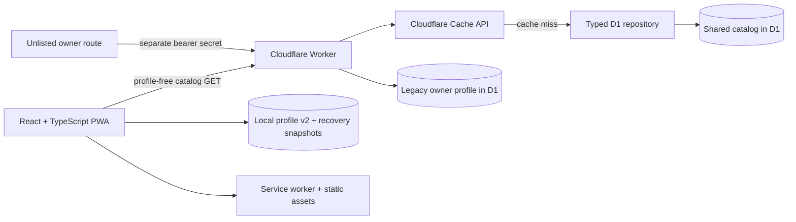

# Architecture

CatchGrid is a local-first Cloudflare Worker application. Vite builds the React SPA and
Worker module, D1 holds the shared catalog and one optional owner profile, and normal
trainer state remains in the browser under the validated
`catchgrid:local-profile:v2` schema.

## Runtime boundaries

- `src/` owns presentation, accessible interaction, local profile coordination, PWA update
  prompts, CSV/full-profile portability, and the typed API client.
- `src/app/` owns custom hash/`/cody` routing and PWA updates; `src/catalog/` owns the
  memoized catalog index and shared regional-medal calculations.
- Dex, Progress/Search Lab, Data, Pokémon detail, and owner API code are lazy boundaries. Their
  feature styles load with the route instead of the initial Home shell.
- `src/lib/api/` separates public catalog, collection, private owner/import, and retained
  legacy-trade calls. Normal public visitors do not download owner/import clients.
- `shared/` owns transport/domain types and deterministic catalog, collection, CSV, and
  search rules used by browser and Worker runtimes.
- `worker/index.ts` owns routing and cache orchestration; `worker/auth.ts`,
  `worker/http.ts`, and `worker/rateLimit.ts` own the private security boundary;
  `worker/repository.ts` and `worker/imports.ts` own D1 workflows.
- `migrations/` is the immutable D1 schema/data history. New catalog snapshots generate a
  new additive migration; an existing migration is never rewritten.
- `catalog/catalog.v1.json`, `catalog/catalog-overrides.v1.json`, and
  `catalog/region-medals.v1.json` are the reviewed catalog inputs.
- `catalog/evolution-families.v1.json` is a dated search aid bundled at build time; the app
  does not fetch it at runtime.
- `public/sw.js`, `public/app-bootstrap.js`, the web manifest, and static headers define
  install, safe caching, controlled updates, and offline behavior.

Wrangler generates binding declarations from `wrangler.jsonc`. The project does not carry
a separately versioned `@cloudflare/workers-types` package.

## Public profile model

Normal users need no account. `LocalProfile` schema version 2 contains:

- standard collection entries for every supported category;
- separate collector-form entries for Regular and Shiny;
- saved visual searches;
- appearance and active-category settings;
- catalog and migration metadata; and
- legacy wanted/specimen arrays retained only so upgrading from v1 never deletes data.

Writes are durable-first: React adopts a change only after validated serialization succeeds.
Storage-disabled, quota, serialization, validation, snapshot, and corrupt-data failures are
typed and displayed rather than converted into an apparent success. Automatic snapshots
rotate, CSV imports require a pre-import snapshot, corrupt raw payloads are preserved under
recovery keys, and full JSON backups can restore the entire profile. CSV and JSON restore
are explicit operations; they do not merge unseen state silently.

Browser storage is origin-scoped. The application detects the legacy `workers.dev` origin,
explains that `dex.cjdev.app` cannot read that storage, and offers an export plus canonical
link without redirecting before the user can save their collection. The v2 loader also
supports one-way migration from `dexly:local-profile:v1` and legacy appearance keys.

## Catalog model

Catalog version `2026-08-24.1` contains 1,025 stable National Dex representatives and 244
reviewed collector forms, or 1,269 form records total. Of the standard representatives, 949
are released in the dated snapshot; unreleased placeholders remain so completion and medal
denominators never scale down to whatever happens to be available today.

Stable form metadata includes `variantKind`, `collectorGroupId`, release/tradeability,
display ordering, form-specific types, optional regional/costume/gender/transformation
metadata, and per-category rule state. Supported groups include regional, costume, gender,
alternate, Mega, Primal, Gigantamax, and fusion forms. Species progress counts only standard
representatives. Collector-form panels track only Regular and Shiny, preventing alternate
forms from inflating the main Dex.

`form_category_rules.state` distinguishes `released`, `unreleased`, `ineligible`, and
`unknown`. Missing state is therefore not confused with eligibility. Sprite mappings use
stable form IDs and a pinned upstream commit, but sprite presence is never release evidence.
The verifier checks source hashes, stable IDs, National Dex continuity, collector families,
medal denominators, sprite paths, and the dated Nickit decision.

## Profile-free edge catalog

The public application uses only these profile-free endpoints:

| Method/path                        | Responsibility                                         |
| ---------------------------------- | ------------------------------------------------------ |
| `GET/HEAD /api/health`             | Worker/release liveness; does not access D1.           |
| `GET/HEAD /api/ready`              | Uncached D1/catalog readiness.                         |
| `GET/HEAD /api/v1/catalog/version` | Small release/catalog version check.                   |
| `GET/HEAD /api/v1/catalog`         | Cacheable catalog and categories; never trainer state. |

`getPublicCatalog` performs a dedicated catalog-only query. The Worker Cache API keys the
response by release, publishes explicit cache metadata, and uses `waitUntil` for cache
writes. The browser does not receive a D1 binding. Unknown `/api/*` paths return JSON errors
instead of falling through to SPA HTML.

## Owner compatibility surface

The unlisted owner route preserves an older D1-backed personal workflow across devices.
`/api/v1/bootstrap`, collection/undo, import preview/apply, and retained wanted/specimen
endpoints are private compatibility APIs, not public navigation or a multi-user service.
Outside loopback they require a constant-time checked `APP_ACCESS_TOKEN`, same-origin
mutations, validated bodies, and scoped authentication/mutation rate limits. If the secret
is absent, they fail closed with `503 PRIVATE_API_NOT_CONFIGURED`.

Private responses are `no-store` and receive defensive content, frame, referrer, and HSTS
headers. Logs include request/release identifiers but not the secret. Production and staging
must use distinct secrets and distinct D1 databases.

## Search Lab search and sharing tools

Search Lab generates collection-gap queries from the reviewed Pokémon GO inventory grammar and
provides personal, tradeable, Cody-recommended, and Discord-ready output. Local profile v2
continues to validate and retain historical saved-search records in portable backups.

Missing Normal, Shiny, XXL, and XXS strings remain collection helpers. Evolution-family
data can add an eligible earlier stage when evolving it could
fill a later XXL/XXS gap when the user enables that option, while true targets remain present if
family metadata is incomplete. Discord messages use either the standard 2,000-character limit or
the user-selected 4,000-character Nitro limit.

## PWA and failure behavior

The service worker versions shell/runtime/catalog caches, precaches every public hashed
JavaScript/CSS route chunk, runtime-caches artwork after a visit, serves a controlled offline
navigation fallback, and excludes private `/api` responses and `/cody`. A waiting worker is activated
only after the user accepts the update prompt. Hashed build assets are immutable; HTML,
bootstrap, manifest, and service-worker files revalidate. Failed sprites use a same-origin
rendered placeholder rather than another third-party request.

A failed catalog request displays a retryable preservation message. It does not render
`0 shown` or otherwise imply that the browser collection was erased.

## Test architecture

- `vitest.config.ts` runs pure unit tests for domain rules, catalog invariants, local-profile
  recovery, CSV parity, search building, Discord output, and PWA cache/update safety.
- `vitest.worker.config.ts` runs API integration tests in Cloudflare's workerd pool;
  `tests/setup-worker.ts` applies all checked-in D1 migrations to isolated storage.
- `scripts/verify-catalog-generation.mjs` proves the catalog generator rejects an existing
  migration before network access; `pnpm catalog:verify` runs it with the catalog verifier.
- CI groups Playwright into a Chromium job (mobile, desktop, PWA) and a WebKit job (mobile,
  desktop). The projects cover responsive
  layout, 44-pixel targets, semantic theme assertions, modal focus, form tracking, catalog
  downtime recovery, and axe checks across public pages.

Automated checks do not replace the still-open real-device VoiceOver, keyboard, 200% zoom,
all-theme contrast/reduced-motion review, production Core Web Vitals, or live release checks.

## Names retained for continuity

CatchGrid is the product name and `dex.cjdev.app` is canonical. The Worker name
`dexly-companion`, fallback origin, D1 names `dexly-db`/`dexly-db-staging`, repository slug,
and legacy `dexly:*` storage keys remain intentionally because renaming them would replace
deployed resources, break bookmarks, or impede safe data migration. They are infrastructure
history, not current public branding.

## Platform references

- [Cloudflare Vite plugin architecture](https://developers.cloudflare.com/workers/vite-plugin/)
- [Static asset routing and bindings](https://developers.cloudflare.com/workers/static-assets/binding/)
- [D1 prepared statements](https://developers.cloudflare.com/d1/worker-api/prepared-statements/)
- [D1 local development](https://developers.cloudflare.com/d1/best-practices/local-development/)
- [Wrangler-generated TypeScript types](https://developers.cloudflare.com/workers/languages/typescript/)
- [Workers Vitest configuration](https://developers.cloudflare.com/workers/testing/vitest-integration/configuration/)
