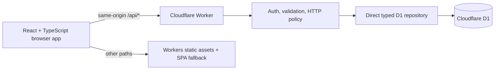

# Architecture

Dexly is one Cloudflare Worker application: Vite builds the React single-page app and
the Worker module, Cloudflare serves the static bundle, `/api/*` runs through the
Worker first, and the Worker is the only component with a D1 binding.



## Runtime boundaries

- `src/` owns presentation, interaction, transient UI state, and the typed API client.
- `shared/` owns transport/domain types plus deterministic collection, search, and CSV
  rules used by more than one runtime.
- `worker/index.ts` owns routing; `worker/auth.ts` and `worker/http.ts` own the security
  boundary; `worker/repository.ts` and `worker/imports.ts` own persistence workflows.
- `migrations/` is the source of truth for D1 schema and seed data.
- `catalog/catalog.v1.json` is the reviewed source manifest; the seed migration is what
  the running application actually reads from D1.

The generated `Env`/binding declarations come from `wrangler types` and the checked-in
Wrangler configuration. The project does not depend on a separately versioned
`@cloudflare/workers-types` package.

## Why the repository uses direct typed D1

The current persistence layer deliberately uses D1 prepared statements directly:

```ts
db.prepare('SELECT ... WHERE profile_id = ?').bind(profileId);
```

Each result shape has a narrow TypeScript row interface and is mapped at the repository
boundary into shared domain types. This keeps the MVP's SQL, transactions, indexes,
conflict rules, and D1 batch behavior visible and auditable. It also avoids a second
schema abstraction while the data model is still small.

The MVP intentionally has no ORM dependency. Adopting one later should be an explicit
architecture change with generated migrations reviewed into `migrations/`; it should
not create a second, competing schema source.

## Data model and consistency

The key separation is:

- catalog facts: species, forms, types, assets, categories, and per-form category rules;
- trainer state: collected and wanted rows, trade specimens, and profile revision;
- safety/audit state: mutation batches/items, import previews, and backup snapshots.

Collection and wanted tables are sparse: a row means `true`; no row means the trainer
has not marked that form/category. This is separate from eligibility. A missing
collection row does not mean a form is valid or released.

`form_category_rules.state` distinguishes `released`, `unreleased`, `ineligible`, and
`unknown`. The Worker rejects collection writes unless the selected rule is `released`.
Collection mutations include a client operation ID for retry idempotency and an
expected profile revision for optimistic concurrency. Undo is accepted only while the
mutation is still the latest revision.

CSV import is a preview/apply workflow. The preview resolves and validates rows before
any collection change, then stores only a bounded action plan and source hash—not the
raw CSV. Apply rechecks the catalog version, collection revision, rules, and prior cell
states. It uses `json_each` set operations so the D1 query count stays constant as the
number of changed cells grows. The same atomic batch records a bounded backup and
mutation history. The backup is an auditable rollback artifact; a user-facing restore
workflow is not part of this vertical slice.

## API surface

| Method/path                       | Responsibility                                               |
| --------------------------------- | ------------------------------------------------------------ |
| `GET /api/health`                 | Public, cacheable Worker/D1 liveness check.                  |
| `GET /api/v1/bootstrap`           | Private catalog, rules, collection, wanted, and trade state. |
| `PUT /api/v1/collection`          | Idempotent, revision-checked collection mutation.            |
| `POST /api/v1/mutations/:id/undo` | Undo the latest compatible mutation.                         |
| `PUT /api/v1/wanted`              | Mark or clear a wanted form/category.                        |
| `POST /api/v1/imports/preview`    | Parse and stage a bounded CSV import.                        |
| `POST /api/v1/imports/:id/apply`  | Apply a previously staged import.                            |
| `POST /api/v1/trades`             | Add a private trade specimen.                                |
| `DELETE /api/v1/trades/:id`       | Remove a private trade specimen.                             |

Unknown `/api/*` routes return JSON errors rather than falling through to the SPA.

## Security and authentication

The present model protects one private collection; it is not a user-account system.

- Loopback hosts use the seeded local actor for frictionless offline development.
- Every non-loopback private API request requires `Authorization: Bearer <token>`.
- If `APP_ACCESS_TOKEN` is absent outside localhost, the private API fails closed with
  `503 PRIVATE_API_NOT_CONFIGURED`.
- The UI retains the access key only in `sessionStorage`, not durable local storage.
- Mutating requests reject a mismatched `Origin`; JSON bodies, identifiers, enums,
  lengths, and upload size are validated at the Worker boundary.
- Private responses are `no-store` and receive defensive content/frame/referrer
  headers. Unexpected errors return a request ID without exposing internal details.
- Static assets receive a restrictive CSP and browser security policy from
  `public/_headers`; sprite images are allowed only from the pinned GitHub asset host.
- D1 is never exposed to browser code, and the application never accepts Pokémon GO
  credentials.

The shared token maps every request to the same seeded profile. Before supporting
multiple people, public profiles, or sharing, replace it with real identity and session
management, per-profile authorization checks, account recovery, rate limiting, and an
abuse/privacy review. Do not describe the shared token as OAuth, password login, or
multi-user authentication.

## Catalog boundaries

Catalog version `2026-08-11.1` contains 23 standard forms across Kanto through Alola.
It is a representative vertical slice, not a complete or automatically current game
catalog. Release/eligibility assertions are dated `2026-08-11`; `null` means “not
asserted,” not `false`.

Sprite mappings are explicit, stable internal form IDs point to a PokeMiners repository
commit, and moving branch URLs are not used. The catalog verifier checks identifiers,
uniqueness, metadata shape, pinned URLs, and safe asset paths. Network checks are
opt-in. Sprite presence alone is never used as gameplay evidence. See
[`catalog/README.md`](../catalog/README.md) for the update and rights-review process.

Generated search strings also have a hard boundary: some game filters are exact, while
others can only narrow results. Shared domain logic reports `exact` or `candidate`
quality and the UI must preserve that distinction.

## Test architecture

Tests are intentionally split by runtime:

- `vitest.config.ts` runs pure/unit tests in Node and excludes Worker tests.
- `vitest.worker.config.ts` runs API integration tests in Cloudflare's workerd-based
  pool. `tests/setup-worker.ts` applies the checked-in D1 migrations to isolated test
  storage before the suite.
- Playwright is a separate end-to-end command and is not part of either Vitest pool. It
  covers mobile grid/Quick Check/undo/search/CSV flows and the desktop shell with an
  intercepted, isolated API; Worker tests remain responsible for real D1 behavior.

This separation keeps fast domain tests simple while exercising Worker bindings,
request handling, auth failure, D1 constraints, imports, and revision behavior in the
Cloudflare runtime.

## Platform references

- [Cloudflare Vite plugin architecture](https://developers.cloudflare.com/workers/vite-plugin/)
- [Static asset routing and bindings](https://developers.cloudflare.com/workers/static-assets/binding/)
- [D1 prepared statements](https://developers.cloudflare.com/d1/worker-api/prepared-statements/)
- [D1 local development](https://developers.cloudflare.com/d1/best-practices/local-development/)
- [Wrangler-generated TypeScript types](https://developers.cloudflare.com/workers/languages/typescript/)
- [Workers Vitest configuration](https://developers.cloudflare.com/workers/testing/vitest-integration/configuration/)
