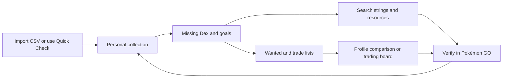
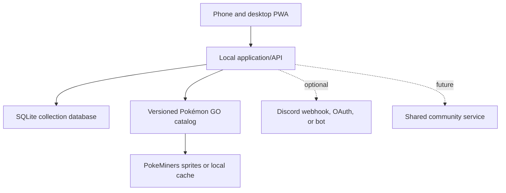

# Pokémon GO Collection Companion

## Project overview

**Working title:** To be determined
**Working tagline:** Complete your Dex together.
**Project type:** Local-first, mobile-friendly web application
**Initial audience:** A single collector running the application on a private home server
**Future audience:** Families, friend groups, local communities, and public Pokémon GO collectors

## Executive summary

Pokémon GO contains many overlapping collection goals: the standard Pokédex, Shiny Dex, Lucky Dex, Perfect Dex, XXL and XXS Dexes, Shadow and Purified collections, costumes, regional forms, Mega and Gigantamax forms, gender differences, special backgrounds, and personal goals. Existing trackers can record many of these categories, but they often present the collection as a large spreadsheet of tiny checkboxes. That approach is slow on mobile, difficult to scan, and disconnected from the familiar visual experience of the in-game Pokédex.

This project will create a visual, local-first collection companion that feels like using a Pokédex. Players browse Pokémon in a sprite grid, switch between collection categories, tap large targets to update progress, open a Pokémon detail sheet to manage every variant, import existing lists through CSV, and generate Pokémon GO search strings from whatever is missing.

The application can begin as a private passion project hosted on a home server with SQLite and PokeMiners sprite assets. The architecture will preserve a future path to shared profiles, a trading board, Discord identity and messaging links, community groups, and optional public hosting.

## The opportunity

Existing collection tools tend to solve only part of the workflow:

- Pokémon GO records many in-game Dexes but does not provide a complete, portable missing-list export.
- Spreadsheet-style trackers support many categories but make collection entry tedious, especially on a phone.
- Search-string sites provide useful filters but are not connected to the collector's actual checklist.
- Trade-list generators rarely compare two complete profiles automatically.
- Costume and form tracking is often separated from the main species experience.

The core opportunity is to connect four activities that currently feel separate:

1. Record what the player owns.
2. Understand what is missing.
3. Generate searches and exports from those gaps.
4. Find another player who has a useful trade match.



## Product vision

> A visual Pokédex that understands every way a player collects, turns missing entries into useful Pokémon GO searches, and makes trade matching effortless.

The experience should be recognizable to a Pokémon GO player immediately. The visual language can be inspired by the clarity and hierarchy of the in-game Pokédex without copying its interface pixel for pixel.

## Product principles

### Visual before tabular

Pokémon should be recognized by sprite, number, name, and collection state. Tables may be available for power users and imports, but they should not be the primary interface.

### One category at a time

Instead of displaying eight tiny checkboxes on every row, the main grid shows the currently selected Dex: Normal, Shiny, Lucky, Hundo, XXL, XXS, Shadow, Purified, or another category.

### Fast enough for an existing collection

A collector may already have hundreds of entries. Bulk selection, generation-level actions, search-assisted reconciliation, CSV import, and undo are essential.

### Local-first and portable

The application should work on a private server without a paid cloud service. Collection data should be easy to back up, export, migrate, and restore.

### Explain generated actions

Search strings—particularly transfer-related strings—must explain what they include and exclude. The product should never describe a general cleanup string as universally safe.

### Model real collection rules

The application should distinguish obtainable, eligible, tradeable, and currently released entries. Impossible combinations should not inflate missing totals.

## Target users

### The completionist

Tracks every official Dex and wants accurate progress by generation, category, form, and gender.

### The shiny hunter

Primarily cares about released Shiny Pokémon, costumes, evolutionary lines, and a clean missing list.

### The trade coordinator

Maintains wanted and available-for-trade lists and wants to compare inventories before an event or meetup.

### The showcase collector

Tracks XXL and XXS species and wants quick searches for current showcase candidates.

### The local community organizer

Wants a shared trading board, player profiles, Discord contact, and event-specific wish lists.

## Primary information architecture

On phones, the primary destinations should use a simple bottom navigation: **Dex**, **Trade**, **Search Lab**, and **Profile**. Home summaries can appear at the top of Dex or as an optional dashboard; the collection itself should never be buried beneath profile statistics.

### Home

- Overall completion summary
- Recently updated entries
- Quick resume button for the last-used Dex
- Current goals and pinned collections
- Import, backup, and reconciliation reminders

### Pokédex

- Visual species grid
- Category selector
- Region and generation selector
- Search and filters
- Missing, collected, obtainable, and unreleased views
- Forms and costume access
- Bulk-edit mode

### Search Lab

- Missing-Dex string generator
- Visual custom string builder
- Recommended searches
- Saved searches
- Search syntax reference
- Search validation and explanations

### Trading

- Wanted list
- Available-for-trade list
- Profile comparison
- Trade matches
- Trading board
- Discord contact actions

### Resources

- Recommended storage-management strings
- Friend-list keywords
- Search-operator reference
- Collection guides
- Trading notes and category limitations
- Import templates

### Settings and Data

- CSV import and export
- Full database backup and restore
- Sprite source/cache management
- Catalog update history
- Appearance and accessibility
- Optional Discord connection

## Core Pokédex experience

### Category-aware visual grid

The player selects a collection category and sees a responsive grid of Pokémon cards. Each card includes:

- National Pokédex number
- Pokémon name
- PokeMiners sprite
- Collected, missing, unavailable, or unreleased state
- Form or costume count where relevant
- Optional trade/wanted indicator

Collected Pokémon display in full color. Missing obtainable Pokémon display as dimmed sprites or a clearly labeled missing state. Unreleased and category-ineligible entries should be visibly distinct and excluded from completion totals.

Suggested controls:

- Tap by default: open the full Pokémon sheet.
- Quick Check mode: turn card taps into one-touch collected/missing toggles.
- Long press or selection control: enter multi-select mode.
- Multi-select: enter bulk-edit mode.
- Filter chip: show missing, collected, released, region, generation, type, form, or costume.

Quick Check mode should be clearly indicated and always provide Undo. This preserves a safe default while still allowing hundreds of existing entries to be recorded quickly.

### Pokémon detail sheet

Opening a Pokémon displays large, touch-friendly collection tiles:

- Normal
- Shiny
- Lucky
- Hundo
- Nundo
- XXL
- XXS
- Shadow
- Purified
- Dynamax
- Gigantamax
- Mega
- Optional living-Dex state

Each category can be collected independently. The detail sheet should separate **Collection**, **Wanted**, and **For Trade** views so personal Dex history is never confused with an actual trade inventory. It also shows forms, costumes, genders, backgrounds, notes, and trade state where supported.

Possible detail actions:

- Mark as owned
- Mark as wanted
- Mark as available for trade
- Record quantity
- Add a note
- Pin as a current goal
- Generate a search for that species or evolutionary family

The default checklist records whether a category has ever been completed. An optional advanced specimen model records real individual offers with combined properties—for example, one specific Pokémon that is simultaneously Shiny, XXL, and costumed.

### Forms and costumes

Forms must be first-class catalog records rather than notes attached to a base species. A form record should know:

- Parent species
- Form identifier
- Display name
- Sprite path and shiny sprite path
- Category eligibility
- Release and shiny-release status
- Trade restrictions
- Evolution restrictions
- Costume family or event grouping

The default grid can show one species card with a form count. The detail sheet displays a visual form gallery, and advanced users can switch to a form-level grid.

## Collection categories

The initial supported categories should include:

- Normal
- Shiny
- Lucky
- Hundo / Perfect
- XXL
- XXS
- Shadow
- Purified

Planned additions:

- Nundo
- Dynamax
- Gigantamax
- Mega evolved
- Costume
- Regional and alternate forms
- Gender completion
- Special or location background
- Best Buddy
- Living Dex
- Shiny Living Dex
- Custom personal categories

Some properties cannot be reliably requested through trades:

- Hundo IVs reroll when traded.
- Lucky status is generated by a trade rather than transferred with the Pokémon.
- Shadow Pokémon cannot be traded.

The product should allow personal tracking for those categories while keeping them out of misleading trade-match results.

## CSV import and export

CSV import is critical for collectors who already maintain spreadsheets or use another checklist.

### Import goals

- Import a provided template with predictable columns.
- Map arbitrary user columns through an import wizard.
- Support one-row-per-species and one-row-per-form formats.
- Accept booleans such as `true/false`, `yes/no`, `1/0`, or `x/blank`.
- Preview changes before writing anything.
- Report unmatched Pokémon, forms, duplicates, and invalid values.
- Allow merge, replace, or update-only behavior.
- Preserve a rollback snapshot before every import.

### Suggested canonical CSV format

```csv
dex_number,form_id,name,normal,shiny,lucky,hundo,xxl,xxs,shadow,purified,wanted,for_trade,quantity,notes
1,001_STANDARD,Bulbasaur,true,true,false,false,true,false,true,false,false,true,2,Community Day extras
1,001_FALL_2019,Bulbasaur Halloween 2019,true,false,false,false,false,false,false,false,true,false,0,
```

This wide format is friendly for spreadsheets. The application should also support a future-proof long format for backups, adapters, and custom categories:

```csv
schema_version,dex_number,form_id,category,collected,wanted,trade_quantity
1,1,001_STANDARD,shiny,true,false,0
1,1,001_STANDARD,xxl,true,false,1
```

### Flexible import wizard

1. Select a CSV file.
2. Detect headers and delimiter.
3. Match columns automatically.
4. Let the user correct mappings.
5. Resolve Pokémon by form ID, Dex number, or normalized name.
6. Preview added, changed, unchanged, and rejected records.
7. Select merge policy.
8. Import and show a result report.
9. Offer one-click undo.

### Export options

- Complete collection CSV
- Missing-only CSV
- Wanted list
- Trade inventory
- Category-specific export
- Human-readable summary
- Full SQLite backup
- Portable JSON backup for future migrations

## Search Lab

Search Lab connects collection data to Pokémon GO's in-game search syntax.

### Missing-Dex generator

For a selected category, the application finds eligible, released, uncollected species and produces an in-game search.

Examples:

```text
1,4,7,25
shiny&1,4,7,25
xxl&1,4,7,25
xxs&1,4,7,25
purified&1,4,7,25
4*&1,4,7,25
```

The generator should:

- Compress consecutive IDs into ranges where useful.
- Split strings that become too long.
- Filter by generation, region, release status, or tradeability.
- Offer names or numbers where appropriate.
- Explain whether the search is for reconciliation or trade discovery.
- Warn when Pokémon GO cannot distinguish an exact costume or form.
- Preview matching Pokémon only when requested.

### Reconciliation mode

Reconciliation searches help find Pokémon the application says are missing but that may already exist in the player's storage. For example, `shiny&1,4,7` can reveal entries that should be checked off.

### Trade-search mode

Trade searches contain only properties that make sense when examining another player's inventory. Hundo, Lucky, and Shadow categories should carry explanations or be excluded from trade-oriented output.

### Visual string builder

The builder lets players choose filters rather than memorizing syntax:

- Species, family, number, and range
- Generation and region
- Type
- Appraisal and individual stat ranges
- CP and HP
- Shiny, Lucky, Shadow, Purified, XXL, XXS, costume, background
- Raid, hatch, research, trade, and Rocket origin
- Age, year, distance, and location-related filters
- Favorite, tags, defender, buddy, and evolution state
- Include, exclude, AND, and OR behavior

The generated string should update live and include a plain-language interpretation.

### Recommended searches

Initial resource presets can include:

- Hundos
- Nundos
- Near-perfect candidates
- Bottle Cap candidates
- Untagged Pokémon
- Recent shinies
- XXL and XXS showcase candidates
- Distance-trade candidates
- Twelve-candy evolution candidates
- Low-cost purification candidates
- Community Day cleanup review
- Duplicate review
- Friend-list searches such as `interactable`, `giftable`, `lucky`, and friendship-level ranges

Transfer-oriented presets must use cautious wording and list every exclusion.

### Saved and parameterized searches

Players can save their own searches with a name, description, category, and optional variables such as `days`, `CP cap`, or `generation`. Saved searches can be pinned to Home or exported with a backup.

## Resources page

The Resources page is the reference library behind Search Lab. It should contain:

- Search syntax basics
- Operators and precedence examples
- Attributes grouped by purpose
- Friend-list keywords
- Ready-to-copy recommended searches
- Plain-language explanations
- Warnings and known limitations
- Search-string change log when Pokémon GO adds or removes terms
- Links from every term into the visual builder
- Community-submitted presets in a future shared edition

The local edition can ship resources as versioned JSON or Markdown so they are easy to update without rewriting the UI.

## Trading system

### Personal trade inventory

Every species or form can independently store:

- Wanted
- Available for trade
- Quantity available
- Trade priority
- Notes
- Special-trade indicator
- Last verified date

This avoids assuming that every owned Pokémon is tradeable.

### Profile comparison

When two profiles are available, the system calculates:

```text
Player A wants ∩ Player B offers
Player B wants ∩ Player A offers
```

Matches can be filtered by Shiny, costume, regional, size, special-trade status, location, and event.

### Trading board

A future shared/community edition can provide listings with:

- Offering and seeking entries
- Sprite and form
- Shiny, size, costume, and background attributes
- Quantity
- Player location or travel radius
- In-person or remote-trade eligibility where the game permits it
- Special-trade notice
- Availability window
- Notes
- Discord contact action
- Listing expiration and refresh

The board should not expose exact home locations. City or general meetup area is sufficient.

### Discord integration

The recommended integration is progressive and intentionally narrow:

1. Create a Discord-formatted trade summary that the player can copy manually.
2. Optionally publish a confirmed listing to a chosen community channel through an incoming webhook.
3. Connect Discord identity through OAuth2 using the minimal `identify` scope.
4. Store Discord user ID, username/display name, and avatar reference.
5. Show a user-controlled **Contact on Discord** action on trade listings.
6. Add a community bot later for `/wanted`, `/trades`, `/match`, mentions, and trade threads.

Discord OAuth2 can provide a basic profile with the `identify` scope. Bot and messaging features require additional permissions and careful token handling. Automated messages should never be sent without a direct user action.

The trading board requires an optional shared server or public deployment. A strictly private, single-user installation can still prepare shareable listings and Discord-ready messages without hosting other players' accounts.

## Sharing and communication

Even before cloud profiles exist, the local application can generate:

- Missing-list text
- Pokémon GO search strings
- Trade-list text
- Shareable PNG cards
- QR codes containing a compact list or local link
- CSV files
- Printable/PDF checklists
- Static HTML profile snapshots
- Discord-formatted trade messages

A public profile should let the owner choose which categories, notes, and trade details are visible.

## Data and technical architecture

### Initial local architecture

- Responsive web frontend
- Local application server
- SQLite database
- PokeMiners sprite URLs with lazy loading
- Optional local sprite cache
- Installable PWA behavior for phone access
- LAN access through an IP address or local hostname



### Suggested implementation

- TypeScript
- Next.js or another React framework
- SQLite with a typed query layer
- Server-side API routes for catalog and collection changes
- Virtualized grid so only visible Pokémon cards render
- Background catalog migration tools

### Core entities

```text
TrainerProfile
PokemonSpecies
PokemonForm
CollectionCategory
CategoryEligibility
CollectionEntry
TradeInventoryEntry
SavedSearch
ResourceArticle
CatalogVersion
ImportJob
BackupSnapshot
```

### Suggested collection model

```ts
type CollectionEntry = {
  profileId: string;
  formId: string;
  categoryId: string;
  collected: boolean;
  wanted: boolean;
  updatedAt: string;
};
```

The initial database should favor a normalized, sparse category model: only marked or customized states need rows, and an absent row represents the default missing state. This makes Dynamax, Gigantamax, backgrounds, gender goals, and custom categories additive rather than schema rewrites.

Actual trade specimens belong in a separate inventory structure so combinations remain intact:

```ts
type TradeInventoryEntry = {
  profileId: string;
  formId: string;
  traits: string[]; // e.g. shiny, xxl, costume
  quantity: number;
  notes?: string;
  verifiedAt: string;
};
```

### Catalog responsibilities

The catalog must distinguish:

- National species identity
- Pokémon GO form identity
- Display name and aliases
- Sprite and shiny-sprite paths
- Release status
- Shiny eligibility
- Shadow/purified eligibility
- Tradeability
- Evolution relationships
- Region and generation
- Costume/event grouping
- Search limitations

### PokeMiners assets

PokeMiners will be the primary sprite source for the passion project. The application should store stable internal form IDs separately from external filenames so asset mappings can be updated without changing collection records.

Recommended behavior:

- Lazy-load only visible images.
- Use a neutral fallback when an asset is missing.
- Record the source path and catalog version.
- Offer an optional local cache or asset-pack import.
- Never make the application depend on rendering thousands of images at once.

### Backup, recovery, and security

- Apply CSV imports, catalog migrations, and bulk edits inside database transactions.
- Create an automatic backup before every import or schema migration.
- Use a consistent SQLite backup operation rather than blindly copying a live database file.
- Maintain rotating daily backups with a configurable retention period.
- Include schema version, catalog version, settings, and optional cached sprites in backup manifests.
- Run integrity checks and provide a guided restore test.
- Keep database files, uploaded CSVs, webhook URLs, OAuth secrets, and bot tokens outside the public web directory.
- Restrict the first installation to the LAN and add authentication before exposing it beyond trusted devices.
- Protect modifying routes from cross-site request forgery and validate every imported filename and field.
- Preserve retired forms as historical catalog records rather than deleting a collector's progress.

## Performance and accessibility requirements

- Virtualize long species and form grids.
- Do not render the same missing list eight times.
- Use approximately 44-pixel minimum touch targets.
- Avoid nested scrolling containers on mobile.
- Use `aria-pressed` or native checkbox semantics for collection states.
- Give every toggle a specific accessible label, such as “Mark Shiny Bulbasaur as collected.”
- Support keyboard navigation, visible focus states, and reduced motion.
- Do not rely on color alone for collected/missing states.
- Keep bulk actions reversible.

## Onboarding

The first-run experience should offer three paths:

1. **Start empty:** build the collection manually.
2. **Quick setup:** mark complete generations or categories in bulk, then correct exceptions.
3. **Import:** upload a CSV or restore a backup.

After setup, a reconciliation assistant can generate searches for categories such as Shiny or XXL so the user can identify entries that were missed during import.

## Roadmap

### Phase 1 — Local collection MVP

- Local server and SQLite
- PokeMiners-backed species catalog
- Visual Pokédex grid
- Normal, Shiny, Lucky, Hundo, XXL, XXS, Shadow, and Purified categories
- Pokémon detail sheet
- Region, generation, search, and missing filters
- Bulk-edit mode with undo
- CSV template import/export
- Full backup and restore
- Basic missing-Dex search generator
- Recommended strings resource page
- Basic visual string builder

### Phase 2 — Complete collector toolkit

- Costume and form gallery
- Flexible CSV mapping wizard
- Search Lab and visual builder
- Recommended-search Resources page
- Saved searches
- Wanted and available-for-trade states
- Shareable images, text, QR codes, and Discord-formatted messages
- PWA installation and offline improvements
- Sprite cache and catalog updater

### Phase 3 — Shared community edition

- Multiple profiles and accounts
- Public/private profile controls
- Profile comparison
- Trading board
- Discord OAuth identity
- User-initiated Discord contact
- Community listings and moderation
- Location-radius and meetup-area filters
- Listing expiration, reports, and blocking

### Phase 4 — Advanced automation and intelligence

- Screenshot-assisted collection import
- OCR-assisted profile/stat import
- Event-aware collection goals
- Notifications when an event features a missing Pokémon
- Friend-group trade optimization
- Collection analytics and milestones
- Localization of Pokémon names and search terms
- Community-maintained resource packs

## Expansion ideas

### Event mode

Select an upcoming event and see:

- Missing featured Shinies
- Costume gaps
- Evolution targets
- Recommended searches
- Trade preparation list
- Event-specific checklist

### Trade-day planner

Combine two or more profiles and propose an efficient trade plan, separating ordinary and special trades and highlighting reciprocal matches.

### Group Trade Night mode

Compare every opted-in profile in a household, local group, or Discord community and calculate the most useful reciprocal matches before an event. Generate a player-by-player plan and verification strings without exposing unrelated private collection data.

### Goal collections

Allow custom goals such as:

- All Kanto Shinies
- Every Pikachu costume
- Shiny Mega-capable species
- XXL starter Pokémon
- Living Shadow Dex
- Regional Pokémon needed for a trip

### Collection health

Flag records that have not been verified recently, entries whose release eligibility changed, and forms with missing sprite mappings.

### Catalog update center

Show newly released species, forms, costumes, Shinies, Shadows, Dynamax entries, and search terms. Let the player review changes before updating totals.

### Household profiles

Support several local profiles for a family or friend group without requiring cloud accounts.

### Import adapters

Add named import profiles for common spreadsheet layouts or exports from other trackers. Keep the canonical CSV format stable and versioned.

### Search-string quality indicator

Label every generated string as **Exact**, **Compressed**, or **Candidate list—visual review required**. This is especially important for costumes and forms that Pokémon GO's search language cannot identify individually.

### Plugin/data-pack system

Allow catalog mappings, resources, recommended strings, themes, and import adapters to be updated independently from the core application.

### Privacy-first sharing

Generate expiring or redacted profile snapshots that reveal only wanted and offered entries, not the entire private collection.

### Achievements and milestones

Offer optional local badges for completing regions, categories, costume families, or custom goals without turning the application into a competitive leaderboard by default.

## Important constraints and non-goals

- The application will not request Pokémon GO account credentials.
- The initial version will not connect directly to Pokémon GO because there is no supported collection-import API.
- Collection updates are manual, CSV-assisted, or eventually screenshot-assisted.
- The application will not claim that a general transfer string is universally safe.
- Hundo, Lucky, and Shadow rules must be represented accurately in trading features.
- The first release will not require public hosting, payments, subscriptions, or advertising.
- Realtime chat should not be built when Discord contact is sufficient.

## Success criteria

The first version succeeds when a collector can:

1. Open the application comfortably on a phone.
2. Import or enter an existing collection without clicking thousands of tiny boxes.
3. See accurate progress for each supported category.
4. Open any Pokémon and understand every collected and missing variant.
5. Generate a useful missing-list search in a few taps.
6. Export and restore the entire collection confidently.

Practical usability targets:

- No horizontal table scrolling on a phone.
- Mark 50 entries in under two minutes using Quick Check or bulk mode.
- Generate a missing-Dex string in two taps from the active category.
- Import an existing CSV without silently dropping or overwriting unmatched data.
- Restore a pre-import backup successfully.

Later community success can be measured by completed profile comparisons, useful reciprocal trade matches, contacted listings, and returning collectors—not merely registered accounts.

## Key decisions already made

- The experience will be visual and Pokédex-like rather than spreadsheet-first.
- The initial product will be local-first and hosted on a private server.
- SQLite is appropriate for the initial collection database.
- PokeMiners will supply Pokémon GO sprites for the passion project.
- The application will track independent collection categories.
- Search strings are a core integrated feature, not an unrelated reference tool.
- CSV import/export and reliable backups are first-class requirements.
- A trading board and Discord integration belong to an optional future shared edition.

## Open product decisions

- Final project name and visual identity
- Exact first-release category list
- Whether quantity tracking belongs in the MVP
- Canonical source and update process for release/eligibility metadata
- How costume families should be grouped and ordered
- Whether the local server should support multiple profiles immediately
- Preferred framework and deployment environment for the home server
- How much of Search Lab belongs in Phase 1 versus Phase 2
- Whether a future community edition is centralized or self-hostable

## Recommended next step

Create a clickable mobile prototype containing:

1. The category-aware Pokédex grid.
2. A Pokémon detail sheet with collection tiles.
3. The missing-Dex string generator.
4. The CSV import preview.
5. A simple wanted/for-trade state.

Testing those five interactions will validate the central product before building the full catalog pipeline, trading board, or community infrastructure.

## Reference notes

- [PokeMiners Pokémon GO asset repository](https://github.com/PokeMiners/pogo_assets)
- [Discord OAuth2 and permission scopes](https://docs.discord.com/developers/platform/oauth2-and-permissions)
- [Discord bots and companion apps](https://docs.discord.com/developers/platform/bots)
- [SQLite Online Backup API](https://www.sqlite.org/backup.html)

These references inform the technical direction but do not replace implementation testing, platform-policy review, or security review before a shared public release.
